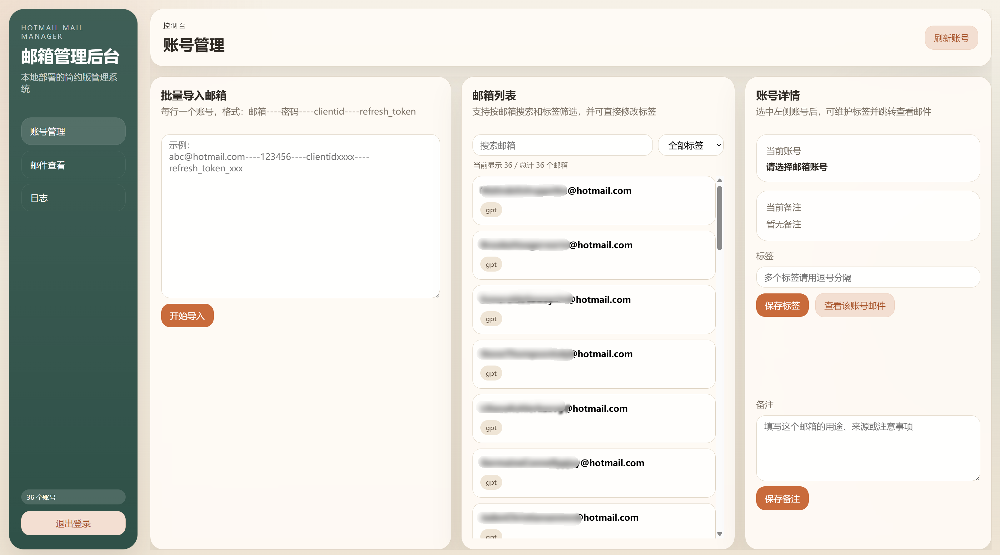
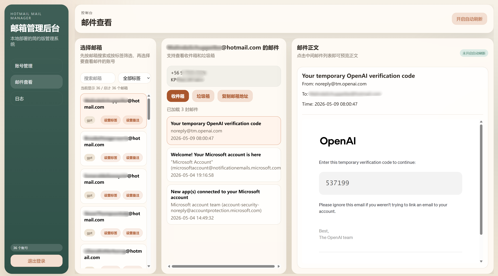
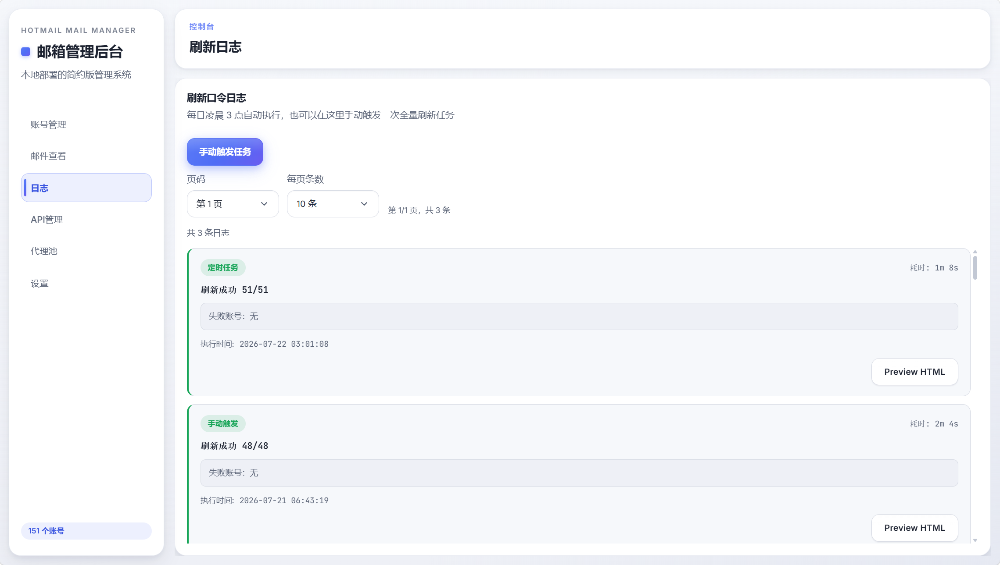

<div align="center">

# 🔥 Hotmail Mail Manager

**一个基于 FastAPI + SQLite 的 Hotmail / Outlook 邮箱批量管理后台**

轻量 · 易部署 · 支持 Graph API / IMAP / POP3 三协议自动切换 · Docker 一键部署

[](https://python.org)
[](https://fastapi.tiangolo.com)
[](LICENSE)
[](#docker-部署)
[](#)

</div>

---

## 📸 项目预览


### 账号管理界面


### 邮件查看界面


### 日志界面（支持折叠显示）


---

## ✨ 项目亮点

- 🚀 **批量导入** — 支持一键导入大量 Hotmail / Outlook 账号，TXT/CSV 文件直接读取
- 🏷️ **标签管理** — 按业务用途、状态、来源快速筛选账号
- 📝 **备注管理** — 为每个邮箱补充用途说明、异常情况、渠道来源
- ⏰ **自动刷新令牌** — 默认每天凌晨 `3:00` 自动执行全量刷新，支持手动触发
- 🔑 **Token 缓存** — Access Token 本地缓存 50 分钟，Refresh Token 更新留痕可追溯
- 📧 **多协议取件** — Graph API / IMAP / POP3 三协议自动切换，支持代理
- 🌐 **代理支持** — IMAP/POP3 支持 SOCKS5 / HTTP 代理，解决 IP 限制问题
- 📦 **邮件查看** — 收件箱 / 垃圾箱邮件直接查看，支持自动刷新
- 🗃️ **单文件数据库** — SQLite + WAL 模式，无需 Redis、无需独立数据库服务
- 🐳 **Docker 部署** — 一行命令部署，数据持久化

---

## 🎯 适用场景

- 管理多组 Hotmail / Outlook 邮箱账号
- 需要给邮箱做标签分类和业务备注
- 需要定期维护 OAuth 令牌，减少令牌失效带来的人工处理
- 需要在一个简单后台里快速查看收件箱和垃圾箱邮件
- 服务器 IP 被微软限制，需要通过代理访问 Outlook 邮件服务

---

## 🛠️ 功能概览

### 1. 邮箱批量导入

支持按行粘贴导入，并支持 **TXT/CSV 文件** 直接读取：

```text
邮箱----密码----client_id----refresh_token           （Graph API，默认）
邮箱----密码----client_id----refresh_token----imap     （切换为 IMAP 协议）
邮箱----密码                                          （IMAP / POP3 协议，仅密码）
邮箱----密码----client_id----refresh_token----pop3----outlook.office365.com:995
```

示例：

```text
abc@hotmail.com----123456----clientidxxxx----refresh_token_xxx
abc2@hotmail.com----123456----clientidxxxx----refresh_token_xxx
imap1@hotmail.com----mypassword----   ← IMAP / POP3 协议，只有邮箱和密码
```

导入时可在页面上选择默认协议（`Graph API` / `IMAP` / `POP3`），未指定时默认 `graph`。

### 2. 智能取件协议链

系统支持三种取件协议，按以下顺序自动尝试，第一个成功即返回：

```
Graph API（HTTP 请求，支持代理池）
  ├─ 成功 → 返回邮件 ✅
  └─ 401/失败 → 降级到 IMAP ↓

IMAP XOAUTH2（支持 SOCKS5/HTTP 代理）
  ├─ 成功 → 返回邮件 ✅
  └─ 失败 → 降级到 POP3 ↓

POP3 XOAUTH2（支持 SOCKS5/HTTP 代理）
  ├─ 成功 → 返回邮件 ✅
  └─ 失败 → 返回错误详情和修复建议
```

**M.C 格式 token 优化**：
- 标准 OAuth2 端点（放宽 scope 验证）→ 可能直接通过 Graph API 取件
- MSAuth 端点 → 返回 `wl.imap` scope token → IMAP XOAUTH2 认证
- token 缓存约 55 分钟（从 `expires_in` 读取，留 5 分钟缓冲）

### 3. 代理管理

支持 SOCKS5 和 HTTP 代理，解决服务器 IP 被微软限制的问题：

- **Graph API** — 通过 `requests` 代理池轮询
- **IMAP/POP3** — 通过 PySocks 创建代理 TCP socket，重写 `_create_socket`
- 代理池自动轮询，单个代理失败自动切换下一个

### 4. 标签与备注管理

- 每个邮箱可维护多个标签（逗号分隔）
- 标签去重与格式规范化
- 按标签筛选邮箱，快速复用历史标签
- 备注支持多行说明，记录邮箱来源、用途、状态、异常原因

### 5. 邮件查看

- 收件箱 `Inbox` 和垃圾箱 `Junk`
- 展示发件人、收件人、主题、时间、邮件正文
- 支持自动刷新，持续观察新邮件
- 后台异步刷新，不阻塞请求

### 6. 每日自动刷新令牌

- 每天凌晨 `3:00` 自动执行全量令牌刷新
- 通过微软 OAuth 接口刷新 `access_token`
- 自动更新 `refresh_token`，旧令牌写入历史表
- 刷新日志支持折叠显示，有失败的默认展开，全部成功的默认折叠

### 7. 自动更新

- 启动后自动检查 GitHub Release 新版本
- 支持一键在线更新，保留 `data/` 数据
- 更新失败自动回滚，数据备份保留供手动恢复

---

## 🐳 Docker 部署

### 方式一：docker-compose（推荐）

```bash
git clone https://github.com/6225858/MicroSoftEmailManage.git
cd MicroSoftEmailManage
docker compose up -d --build
```

### 方式二：docker run

```bash
git clone https://github.com/6225858/MicroSoftEmailManage.git
cd MicroSoftEmailManage
docker build -t ms-email-manager:latest .
docker run -d \
  --name ms-email-manager \
  --restart unless-stopped \
  -p 10019:10019 \
  -e TZ=Asia/Shanghai \
  -v "$(pwd)/data:/app/data" \
  -v "$(pwd)/html:/app/html" \
  ms-email-manager:latest
```

部署成功后访问 `http://<服务器IP>:10019`

---

## 🚀 快速开始（本地运行）

### 1. 安装依赖

```bash
pip install -r requirements.txt
```

### 2. 启动项目

```bash
python icutool_mail.py
```

启动后访问：`http://localhost:10019`

---

## 🏗️ 技术栈

| 组件 | 技术 |
|------|------|
| 后端框架 | FastAPI |
| 模板引擎 | Jinja2 |
| 数据库 | SQLite（WAL 模式） |
| ORM | SQLAlchemy |
| HTTP 请求 | requests |
| 邮件协议 | Microsoft Graph API / IMAP4 / POP3 |
| 代理支持 | PySocks（SOCKS5 + HTTP CONNECT） |
| 运行服务 | uvicorn |
| 容器化 | Docker + docker-compose |

---

## 📁 项目结构

```text
.
├─ icutool_mail.py                # FastAPI 入口与接口定义
├─ oauth_service.py               # OAuth token 刷新逻辑（多端点 fallback）
├─ mail_service.py                # 邮件读取（Graph/IMAP/POP3 + 代理支持）
├─ mail_cache_service.py          # 邮件缓存与后台异步刷新
├─ proxy_service.py               # 代理池管理（SOCKS5/HTTP）
├─ token_refresh_service.py       # 每日自动刷新任务与日志
├─ models.py                      # 数据模型
├─ database.py                    # 数据库初始化（WAL 模式）
├─ templates/
│  ├─ login.html                  # 登录页
│  └─ index.html                  # 后台首页
├─ static/
│  ├─ app.js                      # 前端交互逻辑
│  └─ app.css                     # 页面样式
├─ Dockerfile                     # Docker 构建文件
├─ docker-compose.yml             # Docker Compose 配置
└─ requirements.txt               # 依赖列表
```

---

## 🔐 令牌机制说明

### Access Token 缓存

- 获取到的 `access_token` 缓存在数据库中
- 优先使用 OAuth 响应的 `expires_in`，留 5 分钟缓冲
- 默认缓存约 50 分钟（fallback）
- 未过期时优先使用缓存，减少重复请求

### Refresh Token 自动更新

- 微软返回新的 `refresh_token` 时自动写回
- 旧 `refresh_token` 记录到 `mail_refresh_token_history` 表
- 便于后续排查令牌变化和异常问题

### OAuth 端点策略

```
标准 OAuth2 端点（login.microsoftonline.com）
  ├─ consumers 端点（含 Mail.Read scope → Graph API 可用）
  └─ common 端点（fallback）
      ↓ 失败
MSAuth 端点（login.live.com）
  ├─ refresh_token grant + wl.imap scope（优先）
  ├─ refresh_token grant + wl.basic scope（fallback）
  └─ password grant（最后手段，Hotmail 已禁用）
```

---

## 📊 刷新日志

每次全量刷新任务记录：

- 触发方式：手动 / 定时
- 总账号数、成功数、失败数
- 失败账号与错误原因
- 开始时间 / 完成时间 / 执行耗时
- 支持 HTML 报告预览
- 日志卡片支持折叠/展开，一键全部展开/收起

---

## 🔒 安全说明

- 默认无登录密码，访问根路径即可进入后台
- 外部应用接入通过 `X-Api-Key` 请求头校验
- 不依赖 JWT、Session、Redis
- 适合本机、内网、受控服务器环境

**公网部署建议**：
- 反向代理 + Basic Auth / IP 白名单
- HTTPS
- 更细粒度的权限控制
- 敏感信息加密存储

---

## 📦 数据存储

- SQLite 单文件数据库 `data/mail.db`
- WAL 模式（读写不互斥，支持并发）
- 自动建表，自动补齐缺失字段
- `data/` 目录持久化（Docker 部署时挂载）

---

## 🔄 自动更新

- 启动后自动检查 GitHub Release
- 支持一键在线更新
- 保留 `data/` 目录（邮箱账号、令牌、缓存）
- 更新前自动备份，失败可回滚
- 更新失败时备份数据保留，支持手动恢复

---

## 📝 更新日志

### v1.1.0

- ✨ 支持 IMAP/POP3 代理（SOCKS5/HTTP），解决 IP 限制问题
- ✨ M.C 格式 token 优化，直接用 MSAuth 端点刷新
- ✨ 刷新日志支持折叠显示
- ✨ 数据库启用 WAL 模式，读写不互斥
- 🐛 修复更新后清空用户邮箱账号数据的严重 bug
- 🐛 修复无代理时无法获取邮件的问题
- 🐛 修复删除账号时间过长的问题
- 🐛 修复一直显示"正在加载邮件"的问题

---

## 📄 License

MIT License

---

## 💬 说明

这个项目强调的是：

- **轻量** — 单文件数据库，无需额外服务
- **易部署** — Docker 一键部署，或 `python icutool_mail.py` 直接运行
- **易维护** — 自动刷新令牌，自动更新，日志可追溯
- **面向真实场景** — 批量邮箱管理、多协议 fallback、代理支持

如果你正需要一个可以快速落地的 Hotmail 邮箱管理后台，这个项目会是一个很直接的起点。

---

<div align="center">

**⭐ 如果这个项目对你有帮助，请给个 Star ⭐**

</div>
