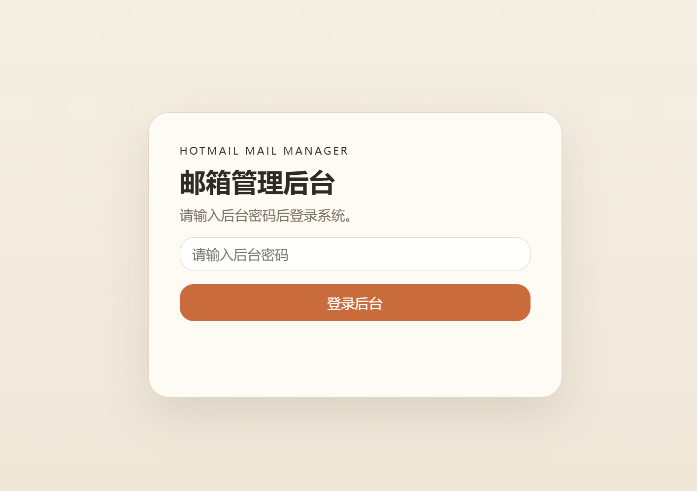

# Hotmail Mail Manager

一个基于 `FastAPI + SQLite` 的 Hotmail / Outlook 邮箱管理后台，适合本地部署和个人或小团队内部使用。

它的核心目标不是做一个复杂的邮件系统，而是把多个邮箱账号集中管理起来，支持批量导入、标签整理、备注记录、邮件查看，以及每日自动刷新令牌，降低手工维护成本。

## 项目预览

### 1. 登陆界面


### 2. 账号管理界面


### 3. 邮件查看管理界面


### 4. 日志界面


## 项目亮点

- 批量导入邮箱账号，支持一键导入大量 Hotmail / Outlook 账号
- 标签管理，便于按业务用途、状态、来源快速筛选账号
- 备注管理，可为每个邮箱补充用途说明、异常情况、渠道来源等信息
- 每日自动刷新令牌，默认每天凌晨 `3:00` 自动执行全量刷新任务
- 手动触发刷新任务，并记录刷新日志、失败详情和执行耗时
- Access Token 本地缓存，减少频繁请求微软接口
- Refresh Token 更新留痕，旧令牌会写入历史表，方便追踪
- 支持查看 `Inbox(收件箱)` 和 `Junk(垃圾箱)` 邮件
- 本地单文件数据库，无需 Redis、无需单独数据库服务，部署成本低

## 适用场景

- 管理多组 Hotmail / Outlook 邮箱账号
- 需要给邮箱做标签分类和业务备注
- 需要定期维护 OAuth 令牌，减少令牌失效带来的人工处理
- 需要在一个简单后台里快速查看收件箱和垃圾箱邮件
- 同一批次中混合使用 Graph API / IMAP / POP3 三种协议取件

## 功能概览

### 1. 邮箱批量导入

支持按行粘贴导入，并支持 **TXT/CSV 文件** 直接读取：

```text
邮箱----密码----client_id----refresh_token           （Graph API，默认）
邮箱----密码----client_id----refresh_token----imap     （切换为 IMAP 协议）
邮箱----密码                                          （IMAP / POP3 协议，仅密码）
邮箱----密码----client_id----refresh_token----pop3----outlook.office365.com:995
```

示例：

```text
abc@hotmail.com----123456----clientidxxxx----refresh_token_xxx
abc2@hotmail.com----123456----clientidxxxx----refresh_token_xxx
imap1@hotmail.com----mypassword----   ← IMAP / POP3 协议，只有邮箱和密码
```

导入时可在页面上选择默认协议（`Graph API` / `IMAP` / `POP3`），未指定时默认 `graph`。
IMAP / POP3 协议下，可在导入时一并设置邮件服务器（默认 `outlook.office365.com`）和 SSL 选项。

导入时会自动区分：

- 新账号：插入数据库
- 已存在账号：更新密码、`client_id`、`refresh_token`、协议与服务器配置
- 格式不正确的行：自动跳过
- 旧账号重新导入时，会自动清空缓存的 `access_token`，避免旧 `scope`（如 IMAP scope）的 token 被复用，从根因上避免 `User is authenticated but not connected` 错误

### 2. 标签管理

每个邮箱都可以维护多个标签，使用逗号分隔。

适合标记：

- 已使用
- 未使用
- 站点A
- 注册号
- token_invalid

系统支持：

- 编辑标签
- 标签去重与格式规范化
- 按标签筛选邮箱
- 快速复用历史标签

### 3. 备注管理

每个邮箱都可以添加备注，用于记录更完整的上下文信息，例如：

- 邮箱来源
- 用途说明
- 当前状态
- 异常原因
- 后续处理记录

相比标签，备注更适合存储多行说明和非结构化信息。

### 4. 邮件查看

支持直接查看邮箱邮件内容：

- 收件箱 `Inbox`
- 垃圾箱 `Junk`

支持展示：

- 发件人
- 收件人
- 主题
- 时间
- 邮件正文

在邮件查看页面中，还可以开启自动刷新，便于持续观察目标邮箱的新邮件。

### 5. 每日自动更新令牌

项目内置后台调度器，应用启动后会自动开启。

默认行为：

- 每天凌晨 `3:00` 按服务器本地时间执行一次全量令牌刷新
- 逐个遍历数据库中的邮箱账号
- 通过微软 OAuth 接口刷新 `access_token`
- 若返回新的 `refresh_token`，会自动更新数据库
- 刷新结果会写入日志表，记录成功数、失败数、失败详情、执行时长

另外，后台页面也支持手动触发一次全量刷新任务，适合临时补刷或排查问题。

## 技术栈

- 后端：`FastAPI`
- 模板：`Jinja2`
- 数据库：`SQLite`
- ORM：`SQLAlchemy`
- OAuth 请求：`requests`
- 邮件协议：`Microsoft Graph API`（默认）/ `IMAP4` / `POP3`
- 运行服务：`uvicorn`

## 项目结构

```text
.
├─ icutool_mail.py                # FastAPI 入口与接口定义
├─ oauth_service.py               # OAuth token 刷新逻辑
├─ mail_service.py                # 邮件读取与 IMAP 交互
├─ token_refresh_service.py       # 每日自动刷新任务与日志
├─ models.py                      # 数据模型
├─ database.py                    # 数据库初始化
├─ templates/
│  ├─ login.html                  # 登录页
│  └─ index.html                  # 后台首页
├─ static/
│  ├─ app.js                      # 前端交互逻辑
│  └─ app.css                     # 页面样式
└─ requirements.txt               # 依赖列表
```

## 快速开始

### 1. 安装依赖

```bash
pip install -r requirements.txt
```

### 2. 设置后台密码（可选，默认无登录）

系统默认开启本地直接访问模式（无登录密码），方便本机或受信任内网使用。
如需启用密码登录，请在启动前自行扩展 `icutool_mail.py` 的中间件逻辑。

历史上曾通过环境变量 `ADMIN_PASSWORD` 控制后台密码，当前版本已移除该机制，
访问根路径 `/` 即可直接进入后台。

### 3. 启动项目

```bash
python icutool_mail.py
```

启动后访问：

```text
http://IP:10019
```

## 数据存储说明

- 默认使用本地 `SQLite` 数据库文件 `mail.db`
- `mail.db` 已在 `.gitignore` 中忽略，不会默认提交到 GitHub
- 项目会自动建表
- 若旧数据库缺少 `remark` 字段，启动时会自动补齐

## 令牌机制说明

项目对令牌做了两层处理：

### 1. Access Token 缓存

- 获取到的 `access_token` 会缓存在数据库中
- 默认缓存 `30 分钟`
- 未过期时优先使用缓存，减少重复请求微软接口

### 2. Refresh Token 自动更新

- 当微软返回新的 `refresh_token` 时，系统会自动写回当前账号
- 旧的 `refresh_token` 会记录到 `mail_refresh_token_history` 表
- 便于后续排查令牌变化和异常问题

## 刷新日志

系统会记录每次全量刷新任务的结果，包括：

- 触发方式：手动 / 定时
- 总账号数
- 成功数
- 失败数
- 失败账号与错误原因
- 开始时间 / 完成时间
- 执行耗时

这部分对排查令牌失效、IMAP 登录失败、接口异常很有帮助。

## 安全说明

当前项目定位为本地管理工具或受信任环境下的内部工具，登录机制较轻量：

- 默认无登录密码，访问根路径即可进入后台
- 外部应用接入通过 `X-Api-Key` 请求头校验
- 不依赖 JWT、Session、Redis

因此更适合：

- 本机使用
- 内网使用
- 受控服务器环境

如果后续要面向公网部署，建议继续补强：

- 更安全的认证机制（如反向代理 + Basic Auth / IP 白名单）
- HTTPS
- 更细粒度的权限控制
- 敏感信息加密存储

## 后续可扩展方向

- 支持更多邮箱状态标签的自动化归类
- 支持导出账号数据
- 支持更丰富的邮件搜索
- 支持多管理员账号
- 支持 Docker 部署
- 支持更完善的异常告警

## 说明

这个项目强调的是：

- 轻量
- 易部署
- 易维护
- 面向真实批量邮箱管理场景

如果你正需要一个可以快速落地的 Hotmail 邮箱管理后台，这个项目会是一个很直接的起点。
